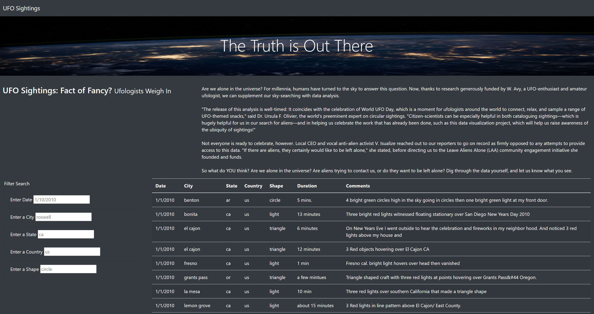
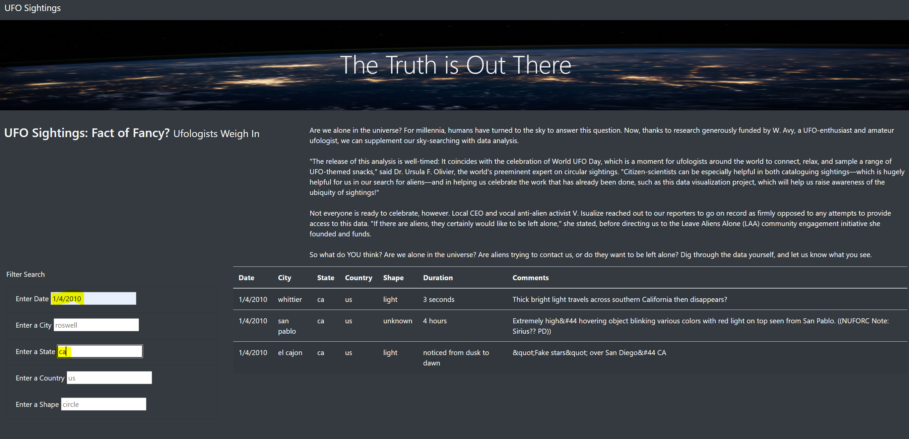
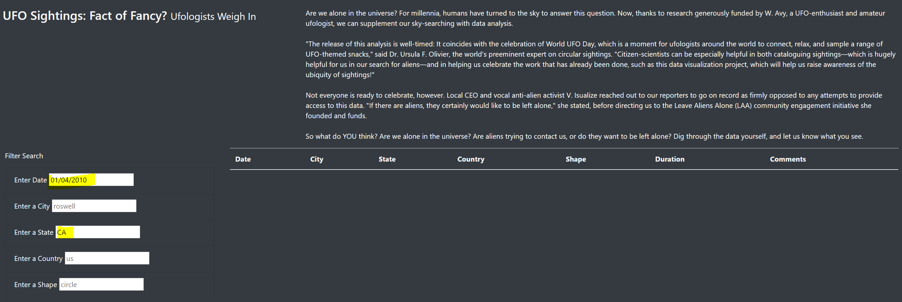

# UFO Sightings with JavaScript

## Overview of the Project/Purpose
In this exercise, we are working with building a webpage and creating a dynamic table. 
Learning the power of JavaScript and HTML, the challenge aims to create a website that
can handle user input, filter the data for multiple criteria, and generate a table reflecting
those results.

---
## Summary: Analysis/Results
Website building is a compilation of different elements. In order to get started, you need to create: 
(1) an HTML file, to build your website 
(2) a JavaScript file, `.js`, so HTML can call upon it 
(3) `.css` file for the purpose of styling your website 
(4) an optional `.jpg` file to add pictures to your website.

In our analysis, we had 2 `.js` files, `data.js` and `app.js`. `data.js` 
contains an exhaustive amount of information meant to fill the data table.
`app.js` is essentially instructions for the html code and meant to provide
guidance through the concept of variables and functions.

In the challenge, we were provided an `app.js` starter code to complete. Within the file, it's instructing
the site to filter data based on the input (from the html code , which essentially is the user input at the 
web page level). In the starter code, we are creating a loop that goes through all the filters and keeps the data 
that matches the filter values.

Looking at the results, we switch over to the actual website.
The actual aesthetic of the site can be best explained by the `style.css`. Here it allows the .jpg to fill out as an
image for the title. In addition, the dark background of the website was embedded within the html code.
In addition as you can see below, the filters on the left hand side are the result of the if-statements
in our `app.js` file.

Next, in testing the filters, it can take in different inputs from the user.
When the user hits enter or clicks to a different area of the webpage, it will generate
filtered data in the table to the right.
Here you see it has been filtered for date "1/4/2010" and state "ca". 

---
### Summary: Suggestions
One drawback with the website is the sensitivity of the input. For example,
if I entered the same input but this time with leading zeros in the date and state is capitalized,
you will see the table generate no results. Hence, as the user, you need to be familiarized with the data
to make sure you're filtering properly.  

My suggestions for site enhancements would be the following: 
(1) allow to take in partial inputs - like '1/4' in the date
would still filter the data for that date and also show any additional years (if available). 
(2) remove the case sensitivity - so "CA", "Ca", "cA", or "ca" would still filter the same output.
